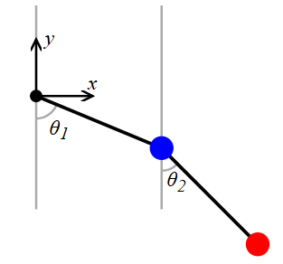

# Nihanje dveh žogic

Oglejmo si primer na sliki:

  
Vir slike: https://scipython.com/blog/the-double-pendulum/

Imamo torej dve žogici z masama $m_1$ in $m_2$ na palčkah dolžine $l_1$ in $l_2$ z zanemarljivo maso.

Recimo, da je prva žogica na $(x_1, y_1)$ in druga žogica na $(x_2, y_2)$.

Potem je $$\begin{align*}
x_1 &= l_1 \sin(\theta_1)\\
x_2 &= l_1 \sin(\theta_1) + l_2 \sin(\theta_2)\\
y_1 &= - l_1 \cos(\theta_1)\\
y_2 &= - l_1 \cos(\theta_1) - l_2 \cos(\theta_2)
\end{align*}$$

**Potencialna energija**  
$V = m g h$  
$h_1 = y_1$  
$h_2 =y_2$

Označimo potencialno energijo z $V$.  
Torej: $$V=V_1 + V_2 = m_1 g(-l_1 \cos(\theta_1)) + m_2 g (- l_1 \cos(\theta_1) - l_2 \cos(\theta_2))$$

**Kinetična energija**  
$$T = \frac{m\cdot v^2}{2}$$
Hitrost žogic dobimo s pomočjo formule $v = \sqrt{\dot{x}^2 + \dot{y}^2}$.

Izračunajmo najprej odvode $x_1, x_2, y_1$ in $y_2$:
$$\begin{align*}
\dot{x_1} &= l_1 \dot{\theta_1} \cos(\theta_1)\\
\dot{x_2} &= l_1 \dot{\theta_1} \cos(\theta_1) + l_2 \dot{\theta_2} \cos(\theta_2)\\
\dot{y_1} &= l_1 \dot{\theta_1} \sin(\theta_1)\\
\dot{y_2} &= l_1 \dot{\theta_1} \sin(\theta_1) + l_2 \dot{\theta_2} \sin(\theta_2)
\end{align*}$$

$$T = T_1 + T_2 = m_1 \cdot \frac{(\dot{x_1}^2 + \dot{y_1}^2)}{2} + m_2 \cdot \frac{(\dot{x_2}^2 + \dot{y_2}^2)}{2}$$

